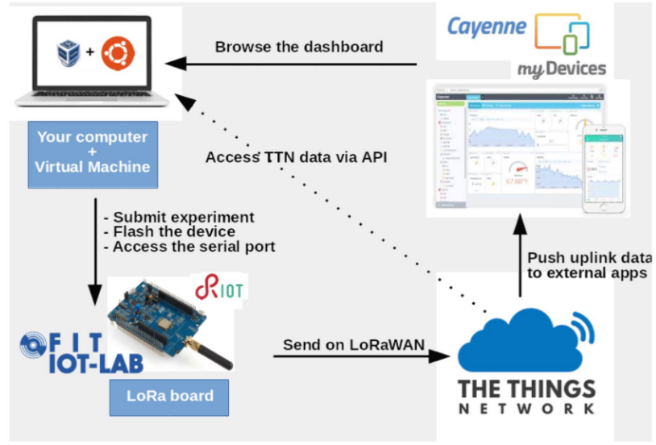

# Tinia

### Inhalt des Projekts
Sind Götter messbar? Wenn es draußen stürmt oder uns der Wind langsam durchs Haar streicht, gibt es nur einen Gott der hier die Finger im Spiel hat: Tinia. Was er scheinbar zufällig geschehen lässt, mal launig, mal sanft, wollen wir in Zahlen fassen. Das Projekt Tinia ist unsere Antwort auf diese wissenschaftlich Lücke, die wir zu schließen gedenken. Ein Annäherungsversuch an eine Macht, die schwer zu greifen scheint. Wir messen Tinias Macht und werten sie graphisch aus. Dazu werden wir neuartige Instrumente zum Einsatz bringen, die die Welt so noch nicht gesehen hat. Wir nennen sie: Wendmesser. Gemeinsam mit dem mächtigen Betriebssystem RIOT entsteht ein Experiment am Rande des Wahnsinns - im transzendenten Raum zwischen Himmel und Erde.

### Architektur

**Grundgerüst**

**Angepasst**

### Hardware und Software

**Wind- und Wetter-Sensorik**

**LoRa-fähiges Board**

**TheThingsNetwork Access Point**

**Cayenne Cloud Server und Dashboard**

