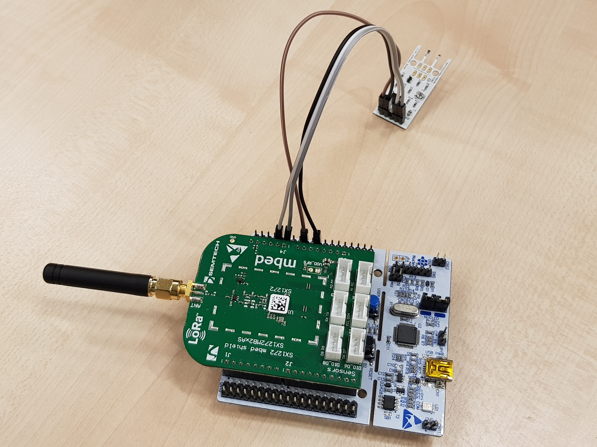

# Wind Sensor Prototype

## Description

Read output from wind sensor, convert it to kmh, send it to TheThingsNetwork over LoRaWAN and output it in Cayenne Cloud.



## Setup
To join a LoRaWAN network using OTAA activation, edit the application
`Makefile` and set your device information:

```bash
DEVEUI ?= 0000000000000000
APPEUI ?= 0000000000000000
APPKEY ?= 00000000000000000000000000000000
```

Finally export the path to your RIOT folder, set your BOARD variable and flash it.

```bash
export RIOTBASE="/path/to/riot"
export BOARD="nucleo-l476rg"
make all flash term
```

## Troubleshooting

- Configure correct pins so that there are no conflicts between the shield and the sensor.
