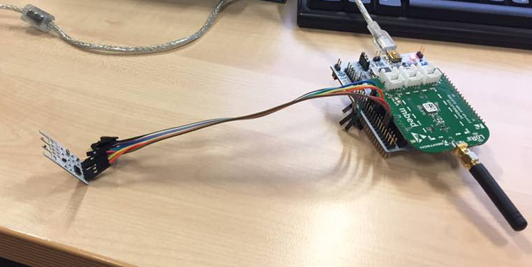

# Wind Sensor Prototype

## Description

Read output from wind sensor, convert it to kmh and print it out.



## Setup
```bash
export RIOTBASE="/path/to/riot"
export BOARD="nucleo-l476rg"
make all flash term
```
